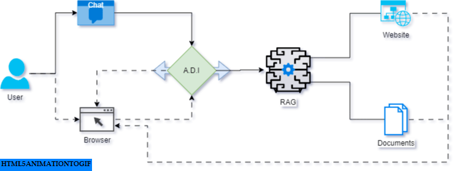
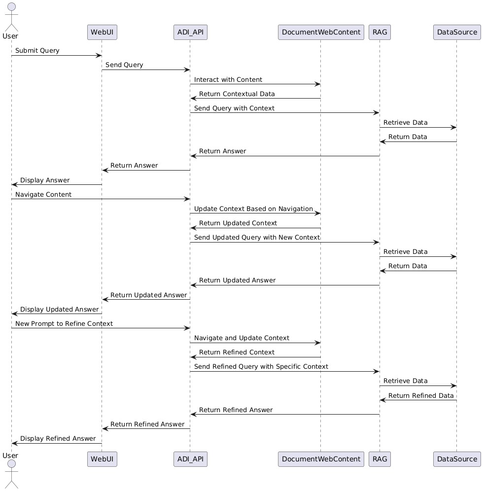

# A.D.I. (Augmented Delegation Interface)

A.D.I. is a cutting-edge tool designed to enhance interaction with documents and web content. It introduces bi-directional Co-Pilot support, enabling dynamic interaction and navigation through content, and improving real-time query responses based on the current context.

## Features

- **Bi-Directional Co-Pilot Support:** Enables dynamic interaction and navigation through content.
- **Enhanced Q/A Capabilities:** Allows real-time answers based on the current context of the content.
- **Extended Interaction:** Facilitates the use of document and web content as inputs in ongoing Q/A sessions.

## Contributing

We welcome contributions to A.D.I.! Please read our [Contributing Guidelines](CONTRIBUTING.md) for information on how to get started.

## Code of Conduct

Please adhere to our [Code of Conduct](CODE_OF_CONDUCT.md) to maintain a positive and respectful community.

## Reporting Issues

If you encounter any issues, please report them on our [GitHub Issues](https://github.com/aditya30051993/A.D.I/issues) page.

## License

This project is licensed under the MIT License - see the [LICENSE](LICENSE) file for details.

## Code Owner

The current code owner of this repository is **@aditya30051993**. For major contributions or significant changes, please reach out to the code owner for approval or guidance.

## Contact

For any questions or feedback, please contact **Aditya** at [aditya30051993@gmail.com](mailto:aditya30051993@gmail.com).

---

Thank you for your interest in A.D.I.!
